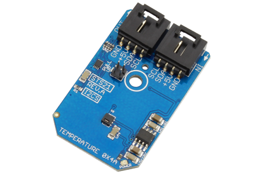

[](https://www.controleverything.com/content/Temperature?sku=STS21_I2CS)
# STS21
STS21 High Accuracy Temperature Sensor 

The STS21 device, provides fully calibrated temperature sensing.
This Device is available from ControlEverything.com [SKU: STS21_I2CS]

https://www.controleverything.com/content/Temperature?sku=STS21_I2CS

This Sample code can be used with Raspberry pi.

##Java 
Download and install pi4j library on Raspberry pi. Steps to install pi4j are provided at:

http://pi4j.com/install.html

Download (or git pull) the code in pi.

Compile the java program.
```cpp
$> pi4j STS21.java
```

Run the java program as.
```cpp
$> pi4j STS21
```

##Python 
Download and install smbus library on Raspberry pi. Steps to install smbus are provided at:

https://pypi.python.org/pypi/smbus-cffi/0.5.1

Download (or git pull) the code in pi. Run the program

```cpp
$> python STS21.py
```

The code output is temperature reading in degree celsius and fahrenheit.

